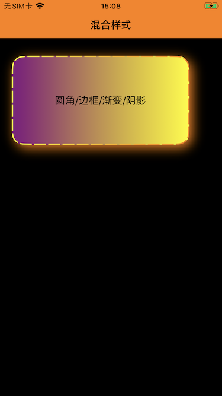

# ZTUIStyle

## 欢迎使用 ZTUIStyle

### 宗旨：专治原生控件各种不服

### 目标：iOS UI 快速开发

### 说明

> iOS UI 开发常用：圆角，边框，Gradient背景渐变，阴影
>
> 普通解决方案缺点：代码冗余，复用性差，自由度低
>
> ZTUIStyle 优点：优化代码，简化使用，快速开发
>

UI 快速开发，为 UIView 及其 子类 提供了一系列关于 UI 样式的快速实现方式，使用方便，实现高效，无侵入

- [Y] 通过 CALayer 实现，效率高
- [Y] 不依赖 frame ，框架自适应 UIView 大小
- [Y] 支持多种效果同时使用
- [Y] 支持 UIView 及其 所有子类


### 基础功能

| 功能			| 属性值			 				            | 
| ------------- | -------------  				            | 
| 圆角 			| 圆角方向 / 圆角大小  			 	        | 
| 边框     		| 边框宽度 / 边框颜色 / 虚线边框 / 边框渐变       | 
| 阴影     		| 阴影颜色 / 阴影偏移 / 阴影大小 / 阴影透明度      | 
| 渐变			| 渐变方向 / 渐变颜色  		                | 


### 效果图

  
  



### 使用
#### Podfile 导入库

```objectivec

pod 'ZTUIStyle', '~>0.0.2'

```

#### 导入样式分类

```objectivec

#import "UIView+ZTUIStyle.h" //导入样式分类

```

#### 使用样式
```objectivec

    UILabel *viewMixed;
    NSArray<UIColor *> * colors = @[[UIColor purpleColor],[UIColor yellowColor]];

    //设置圆角
    [_viewMixed zt_cornerWithCornerRadii:20];
    
    //设置边框
    NSArray<NSNumber *> *dashPattern = @[@20,@4];
    [_viewMixed zt_borderWithBorderWidth:4.0f 
                            withBorderGradientColors:colors 
                            withBorderGradientDirection:GradientDirectionRight2Left 
                            withLineDashPhase:4.0f  
                            withLineDashPattern:dashPattern];
    
    //设置渐变
    [_viewMixed zt_gradientWithGradientColors:colors 
                                withDirection:GradientDirectionLeft2Right];
  
    //设置阴影
    [_viewMixed zt_shadowWithShadowColor:[UIColor orangeColor] 
                        withShadowRadius:10.0f 
                        withShadowOffset:CGSizeMake(5, 5)];
```

### API介绍

##### 圆角
```objectivec
/// 圆角
/// @param uiRectCorner UIRectCorner 指定圆角方向（左上，右上，，，全部），可以组合使用
/// @param cornerRadii 圆角大小
- (void)zt_cornerWithUIRectCorner:(UIRectCorner)uiRectCorner 
              withCornerRadiiSize:(CGSize)cornerRadii;

- (void)zt_cornerWithUIRectCorner:(UIRectCorner)uiRectCorner 
                  withCornerRadii:(float)cornerRadii;

- (void)zt_cornerWithCornerRadii:(float)cornerRadii;
```

##### 边框
```objectivec
/// 边框
/// @param borderWidth 边框宽度
/// @param borderColor 边框颜色
/// @param lineDashPhase 虚线起始位置
/// @param lineDashPattern 虚线模型NSNumber数组：奇数位数值表示实线长度，偶数位数值表示空白长度
/// @param gradientColors 边框渐变颜色
/// @param gradientDirection 边框渐变方向
- (void)zt_borderWithBorderWidth:(CGFloat)borderWidth 
                withBorderColor:(UIColor*)borderColor 
                withBorderGradientColors:(nullable NSMutableArray<UIColor*>*)gradientColors 
                withBorderGradientDirection:(GradientDirection) gradientDirection 
                withLineDashPhase:(CGFloat)lineDashPhase 
                withLineDashPattern:(nullable NSArray<NSNumber *> *)lineDashPattern;

- (void)zt_borderWithBorderWidth:(CGFloat)borderWidth 
                withBorderColor:(UIColor*)borderColor 
                withLineDashPhase:(CGFloat)lineDashPhase 
                withLineDashPattern:(NSArray<NSNumber *> *)lineDashPattern;

- (void)zt_borderWithBorderWidth:(CGFloat)borderWidth 
                withBorderColor:(UIColor*)borderColor;

- (void)zt_borderWithBorderWidth:(CGFloat)borderWidth 
                withBorderGradientColors:(NSMutableArray<UIColor*>*)gradientColors 
                withBorderGradientDirection:(GradientDirection) gradientDirection;

- (void)zt_borderWithBorderWidth:(CGFloat)borderWidth 
                withBorderGradientColors:(NSMutableArray<UIColor*>*)gradientColors 
                withBorderGradientDirection:(GradientDirection) gradientDirection 
                withLineDashPhase:(CGFloat)lineDashPhase 
                withLineDashPattern:(NSArray<NSNumber *> *)lineDashPattern;
```

##### 渐变
```objectivec
/// 背景渐变
/// @param gradientColors 渐变颜色数组 @[ UIColor , UIColor ]
/// @param direction 渐变方向
/// @param gradientLocations 渐变位置数组
- (void) zt_gradientWithGradientColors:(NSMutableArray<UIColor*>*)gradientColors 
                    withDirection:(GradientDirection)direction 
                    withGradientLocations:(nullable NSArray*)gradientLocations;

- (void) zt_gradientWithGradientColors:(NSMutableArray<UIColor*>*)gradientColors 
                    withDirection:(GradientDirection)direction;
```

##### 阴影
```objectivec
/// 阴影
/// @param shadowColor 阴影颜色
/// @param shadowOffset 阴影偏移
/// @param shadowRadius 阴影圆角
/// @param shadowOpacity 阴影透明度
- (void)zt_shadowWithShadowColor:(UIColor*)shadowColor 
                withShadowRadius:(CGFloat)shadowRadius 
                withShadowOpacity:(float)shadowOpacity 
                withShadowOffset:(CGSize)shadowOffset;

- (void)zt_shadowWithShadowColor:(UIColor*)shadowColor 
                withShadowRadius:(CGFloat)shadowRadius 
                withShadowOpacity:(float)shadowOpacity;

- (void)zt_shadowWithShadowColor:(UIColor*)shadowColor 
                withShadowRadius:(CGFloat)shadowRadius;

- (void)zt_shadowWithShadowColor:(UIColor*)shadowColor 
                withShadowRadius:(CGFloat)shadowRadius 
                withShadowOffset:(CGSize)shadowOffset;
```


### 版本历史

**0.0.2**　`2023.02.24`　优化释放资源逻辑

**0.0.1**　`2022.12.28`　发布第一版本


## License

```
MIT License

Copyright (c) 2022 Ruffian-痞子
```

